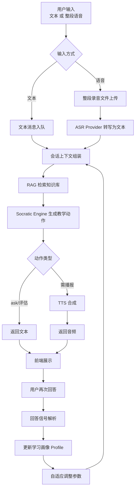
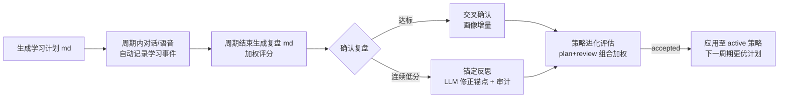
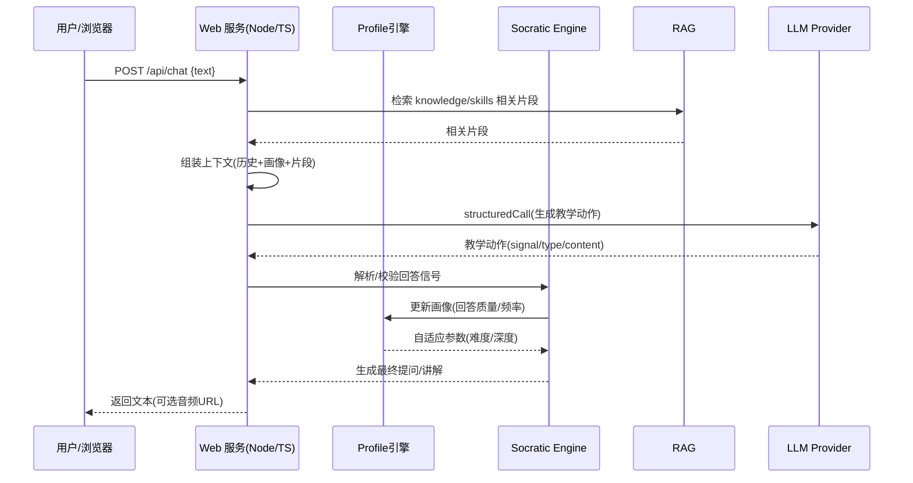
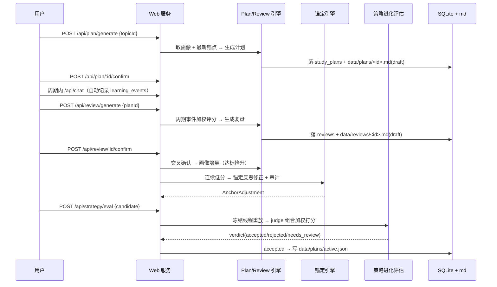
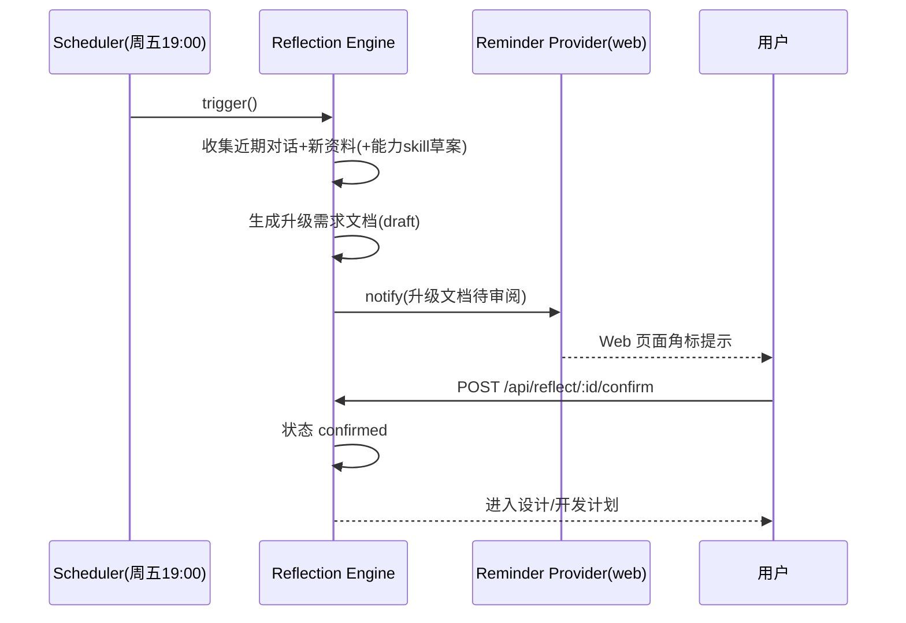
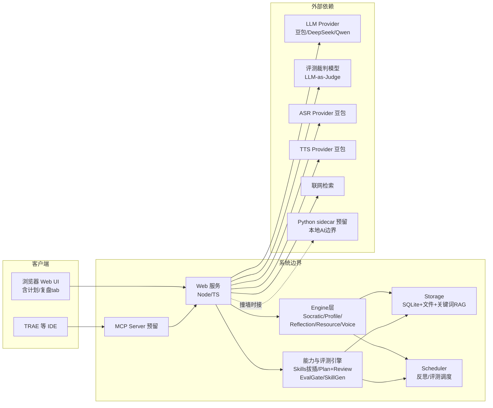
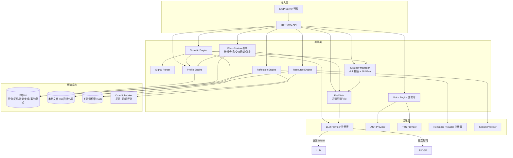

# 总体设计文档：Socratic Tutor

- 版本：v1.1.0
- 日期：2026-09-09
- 阶段：方案设计（Project Creator 阶段 2.1）
- 依赖：`docs/requirements.md`、`docs/design/debate/*`、`docs/design/socratic-tutor_detail-design.md`（详细设计）
- 技术选型结论：**Node.js/TypeScript 单体（Fastify + Vue）+ 强 Provider 抽象 + 轻量 md 关键词检索 + SQLite（node:sqlite）+ 预留 Python sidecar 边界**（见 debate/synthesis.md 与 development-plan.md OQ 节）

> 本文件供**人**审查。重点审查业务逻辑是否合理、总体框架是否清晰、系统边界是否合理。
> 版本演进：v1.0（2026-09-02）→ v1.1.0（2026-09-09，skill 拔插 / 评测门禁 / 学习计划 + 复盘阶段落地）。详见 §7 版本迭代说明。

---

## 1. 系统流程图

苏格拉底对话主流程（文本 + 非实时语音）：

学习计划 → 复盘自我进化闭环（0.4.0 新增）：

异常分支：无音频→提示重录音；Provider 失败→降级提示并重试；RAG 无命中→回退通用 LLM；LLM 结构化失败→回退启发式策略（计划/复盘/锚定/评测降级）。

---

## 2. 时序图

学习计划 / 复盘 / 进化评估时序（0.4.0）：

反思升级闭环时序：

---

## 3. 系统边界图

---

## 4. 组件架构图

---

## 5. 关键设计原则

1. **依赖倒置**：引擎只依赖 Provider **接口**，不依赖具体 SDK；工厂注册表集中管理与切换；LLM/裁判/ASR/TTS/Search 全部可插拔。
2. **AI 本地化边界**：预留 Python sidecar 插件口，撞墙即插，避免未来重构。
3. **实时语音隔离**：Phase 2 WebSocket 通道独立演进，不影响文本链。
4. **反思闭环须人工确认**：升级文档未确认不自动进入设计与开发。
5. **docs=唯一依据**：需求 → 设计（总体+详细） → 开发计划逐级可审查、可追溯。
6. **文档状态机**：计划/复盘/反思均为 draft→confirmed，未确认不推动下一步；生成按 id 幂等。
7. **计划↔复盘交叉确认**：复盘确认后按计划目标比对，达标主题回写画像增量（掌握度+兴趣），动态校准学习画像。
8. **锚定反思**：连续多期复盘加权分低于阈值时，自动诊断"画像锚点是否有误"并修正（LLM 优先 + 启发式降级 + 审计落盘）。
9. **组合加权进化评估**：计划/复盘两能力以可插拔策略表达；进化须经 plan+review 组合加权评测（默认各 0.5），verdict accepted 且人工确认后才应用。
10. **评测回测门禁**：新能力（skill/策略）必须过冻结线程回放 + LLM-as-Judge 打分 + 人工拦截，禁止未评估自动上线。

---

## 6. 边界与外依赖清单

| 依赖 | 是否外部 | 说明 |
|---|---|---|
| LLM（豆包默认/qwen/deepseek/EXTRA） | 外部 | OpenAI 兼容 HTTP，Provider 抽象 |
| 评测裁判模型（LLM-as-Judge） | 外部 | 可独立配置（JUDGE_PROVIDER/MODEL），默认跟随主模型 |
| ASR / TTS | 外部 | 豆包真实提供方 + Mock 兜底；Phase 2 支持流式 |
| 联网检索 | 外部 | Search Provider 可插拔 |
| Python sidecar | 预留外部 | 本地 AI 边界（SOTA 模型） |
| SQLite / 文件 / 关键词 RAG | 内部 | 本地存储（向量库预留） |

**人审要点确认**：① 业务逻辑（苏格拉底四象限 + 反思须确认 + 计划/复盘自我进化闭环）是否合理；② 组件划分（能力引擎层与基础引擎层）是否清晰；③ 边界（外部依赖最小化、Provider 可切换、评测门禁）是否可接受。

---

## 7. 版本迭代说明

### v1.0（2026-09-02）
- 初始总体设计：文本对话 + 画像/自适应 + 反思闭环 + Web + 非实时语音 + 资料引擎/RAG 基础（对应软件 0.1.0）。

### v1.1.0（2026-09-09，对应软件 0.2.0–0.4.0）
本版涉及**架构、系统边界、设计原则、主要功能流程**的变化，逐项说明：

1. **架构变化**：
   - 引擎层新增「能力与评测引擎」：`skills`（能力 skill 拔插）、`eval`（评测回测门禁 EvalGate）、`skillgen`（能力 skill 生成）、`plans`（学习计划 + 复盘，含评分/交叉确认/锚定/策略评估 10 文件）。
   - 调度层新增 `EvalScheduler`（每周抽样 + 每月全量评测，独立于每周反思调度）。
   - 语音能力落地为豆包真实 ASR/TTS 提供方（HTTP 直连），Mock 兜底全链路可跑。

2. **系统边界变化**：
   - 新增外部依赖「评测裁判模型」（LLM-as-Judge，可独立配置）。
   - 存储扩展：SQLite 新增 4 表（`study_plans` / `reviews` / `anchor_adjustments` / `learning_events`），md 产物三件套（`data/plans|reviews|anchors`），策略注册表 `data/plans/active.json`、skill 注册表 `data/skills/active.json`、评测快照 `data/evals/snapshots/`。
   - API 扩展：新增计划/复盘/策略/锚点 9 条路由（`/api/plan/*`、`/api/review/*`、`/api/strategy/*`、`/api/anchors/latest`）；前端新增「计划/复盘」tab。

3. **设计原则变化**：新增原则 6–10（文档状态机、交叉确认、锚定反思、组合加权进化评估、评测回测门禁）。

4. **主要功能流程变化**：新增「学习计划 → 学习事件积累 → 复盘加权评分 → 确认（交叉确认 + 锚定反思）→ 策略组合加权进化评估 → 应用」自我进化闭环（详见 §1 第二流程图与 §2 时序图）。
