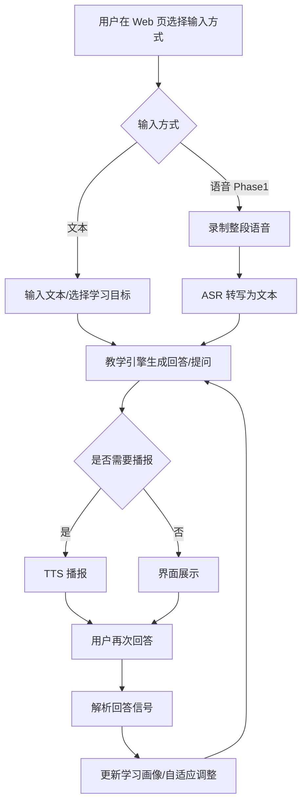
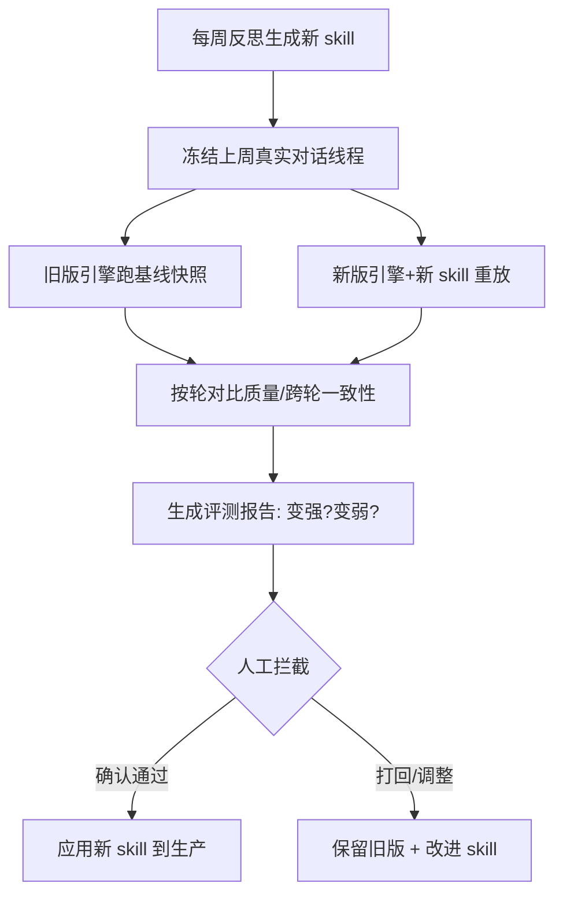

# 需求分析文档：对话式苏格拉底教学 Agent（Socratic Tutor）

- 版本：v1.0

- 日期：2026-09-02

- 阶段：需求分析（Project Creator 阶段 1）

- 状态：已与用户确认

***

## 0. 背景与目标

本项目构建一个以**苏格拉底式对话启发**为核心教学法的个人学习陪伴 Agent（Socratic Tutor）。核心价值不是"灌输答案"，而是通过层层提问引导用户自主思考、探索、建构理解；依据**每次回答质量与学习频率**自适应调整教学方案，激发并维持学习兴趣；并具备**每周自我反思升级**（吾日三省吾身）与**书籍/论文/视频总结检索**能力。

已确认的关键决策：

- 形态：基于现有大模型 API 的应用（本地 Web 服务，预留可部署）。

- 默认 Provider：**豆包（Doubao）**，支持切换。

- 语音：Phase 1 非实时（ASR→文本→TTS），Phase 2 实时双向语音（可打断，参照豆包）。

- 反思定时：默认周五 19:00，可配置。

- 反思提醒：默认 Web 页面，通道可扩展（预留邮箱/微信）。

- IDE 集成：预留 MCP 接口，优先接入 TRAE。

***

## 1.1 用户故事（User Stories）

| ID    | 故事                                                                | 优先级    |
| ----- | ----------------------------------------------------------------- | ------ |
| US-01 | 作为学习者，我希望通过语音/文本与 Agent 进行苏格拉底式对话，以便在追问中自主思考并理解知识点。               | Must   |
| US-02 | 作为学习者，我希望 Agent 用提问而非直接给答案，以便真正建构理解而不只是记住结论。                      | Must   |
| US-03 | 作为学习者，我希望 Agent 根据我的回答质量与学习频率调整难度、深度与资料推荐，以便教学贴合我的进度。             | Must   |
| US-04 | 作为学习者，我希望 Agent 激发我的学习兴趣（进度激励、正向反馈、情境切换），以便保持学习动力。                | Could  |
| US-05 | 作为用户，我希望 Agent 每周定时自我检索并生成《升级需求文档》，经我确认后才改进，以便 Agent 持续进化且不擅自变更。  | Must   |
| US-06 | 作为用户，我希望反思结果在 Web 页面提醒我，以便及时审阅（后续可扩展邮箱/微信）。                       | Should |
| US-07 | 作为学习者，我希望 Agent 能联网检索并总结书籍/论文/视频，以便围绕学习目标获取资料。                    | Should |
| US-08 | 作为使用者，我希望学习用书籍经 book-to-skill 整理为本地 md 知识库，以便作为对话的知识源。            | Should |
| US-09 | 作为开发者，我希望模型 Provider 可切换、可热更新，以便灵活使用豆包/DeepSeek 等。                | Should |
| US-10 | 作为用户，我希望该能力能嵌入 TRAE 等 AI 编程 IDE，以便在编程环境中使用对话教学。                   | Should |
| US-11 | 作为学习者，我希望教学引擎与学习画像/自适应可通过增加或调整多个 skill 来调整其能力，以便教学策略可插拔、可演进。      | Should |
| US-12 | 作为用户，我希望每周反思若生成新 skill 先经过基于历史对话的重放评测（判定是否变强），经我拦截确认后才应用，以便迭代不退化。 | Should |

***

## 1.2 操作流程（Operation Flows）

### 1.2.1 学习对话主流程（文本 + 非实时语音）



**异常/分支**：无音频→提示重录；Provider 失败→降级提示；画像未命中→通用回答。

### 1.2.2 每周反思升级流程（吾日三省吾身）

```mermaid
flowchart TD
    A[每周五19:00 定时触发] --> B[收集近期对话记录]
    B --> C[检索新增资料/新需求]
    C --> D[生成升级需求文档草案(draft)]
    D --> E[Web 页面提醒用户审阅]
    E --> F{用户确认?}
    F -->|否| G[用户修改/打回, 保留草稿]
    G --> D
    F -->|是| H[生成设计文档 + 开发计划]
    H --> I[执行开发并更新 Agent]
    I --> J[进入下一周循环]
```

**异常/分支**：确认通道不可用→站内待办池提醒；文档未确认→不自动进入设计与开发。

***

## 1.3 UI 设计（UI Design）

### 页面清单

| 页面     | 说明                            |
| ------ | ----------------------------- |
| 对话页    | 主界面：聊天记录 + 输入框（文本/录音切换）+ 语音播放 |
| 学习目标页  | 设置/切换当前学习主题与目标                |
| 画像页    | 展示掌握度、学习频率、兴趣偏好               |
| 反思/升级页 | 展示最新升级需求文档、确认/修改按钮            |
| 资料库页   | 展示 book-to-skill 产物知识列表       |

### 对话页线框（文本）

```
┌────────────────────────────────────────────┐
│ Socratic Tutor                    [画像] [资料] │
├────────────────────────────────────────────┤
│  Agent: 关于这个概念，你觉得它为什么成立？       │
│  你  : 因为……                        (14:03) │
│  Agent: 那如果反过来呢？什么情况下它不成立？     │
├────────────────────────────────────────────┤
│  [📁选择目标] [🎤录音/文本切换] [🔍检索] [发送]  │
└────────────────────────────────────────────┘
```

### 反思/升级页线框

```
┌────────────────────────────────────────────┐
│ 每周反思升级（2026-xx-xx 草案）            [编辑] │
│  ├ 观察点：……                              │
│  ├ 建议改进：……                            │
│  └ 新增资料：……                            │
│               [ ✅ 确认 ]  [ ✏️ 修改 ]          │
└────────────────────────────────────────────┘
```

***

## 1.4 页面与技术选型（Page & Tech Selection）

- **承载形态**：本地 Web 服务（浏览器访问）。

- **后端**：Node.js + TypeScript（本机已有便携 Node v24.19.0）或 Python FastAPI —— 待开发阶段最终确定。

- **前端**：轻量 Web 聊天界面（HTML/Vue/React），待确定。

- **LLM Provider**：统一接口抽象，默认豆包（Doubao），适配 DeepSeek 等，运行时热切换。

- **语音**：Phase 1 非实时（ASR→文本→TTS）；Phase 2 实时双向（VAD 断句 + 流式 ASR/TTS，可打断，参照豆包）。

- **存储**：SQLite（画像/对话/反思元数据）+ 本地文件系统（md 知识库、音频）。

- **RAG**：**轻量 md 全文/关键词检索 + LLM 筛选**（不引入向量库；向量 RAG 延迟 Phase 3）。

- **引擎能力**：教学引擎与画像/自适应引擎**支持 skill 拔插**，可通过增加/调整多个 skill 调整行为。

- **评测回测**：每周反思生成 skill 后，以历史对话**多轮线程重放 + 快照基线对比**测试变强/变弱，自动评测 + 人工拦截；评测框架**可切换**。

- **定时**：cron（默认 `0 19 * * 5`）。

- **提醒**：Reminder Provider 抽象，默认 `web`，预留 email/wechat。

- **集成/部署**：预留 MCP Server（优先 TRAE）+ Docker 部署。

**选型理由**：优先"快速跑通教学核心"，故后端轻量、Provider 抽象化以降低对单家 API 依赖；实时语音复杂度高，先做非实时验证教学逻辑，再迭代。

***

## 2. 能力演进机制（新增需求，2026-09-02 确认）

补充两条机制，支撑 Agent 的持续进化与质量保证。

### 2.1 引擎能力 skill 拔插

**目标**：教学引擎（Socratic）与学习画像/自适应引擎（Profile）的能力，可通过**增加或调整多个 skill** 进行调整，而非改死代码。

- 定义统一的 **能力策略接口（Capability Strategy）**，一个 skill = 一个可插拔的策略模块（规则/prompt/参数/评分函数）。

- 引擎通过「策略管理器」按需加载 skill，支持：运行时启用/停用、替换某个 skill、叠加多个 skill。

- 典型 skill 示例：苏格拉底提问模板 skill、兴趣激励 skill、难度自适应 skill 等。

- 约束：skill 与引擎解耦，不侵入引擎核心；skill 本身是轻量、可独立评估的对象（为后续回测服务）。

- **形态（已确认）**：能力策略 skill **纯 TS 实现**（`src/engines/skills/`，含规则/prompt/参数/评分逻辑）。

- 词汇区分：本节「skill」指**能力策略 skill（教学/画像引擎的可拔插行为模块）**；`knowledge/skills/` 下的 book-to-skill **知识 md** 是独立的 RAG 资料库。两者**职责与目录分离**，但存在转化链路，见下一节。

- **知识产物 → 能力策略 skill（可选增强链路，2026-09-02 补充）**：book-to-skill 产出的知识 md，若属于**教学/教育方法论**类内容（如探讨提问技巧、激励方法、自适应策略的书籍/论文/视频），同样可在反思流程中据此**生成/更新能力策略 skill**，从而增强教学引擎或画像/自适应引擎的行为模块。此为可选路径——仍需经 2.2 评测回测门禁 + 人工拦截后才应用。

### 2.2 每周反思回测门禁（回归测试）

**目标**：每周反思若生成新 skill，先经**基于历史对话的评测**判定"变强/变弱"，**人工拦截确认**后才应用，防止迭代退化。

决策细节（用户确认，2026-09-02）：

- **实现路线**：**自建轻量评测 + 统一评测接口** —— 默认自建（历史对话 + 快照 + LLM rubric 对比 + A/B 胜率 + 本地报告）；评测框架**可扩展接入/切换**（预留 Promptfoo/AgentBench/DeepEval 等，作为统一接口的其它后端）。见 socratic-tutor_detail-design.md「评测回测模块」。

- **判定方式**：**rubric 打分 + A/B 胜率** ——

  - *rubric 打分*：LLM-as-Judge 按教学 rubric 分维度打分（引导有效性、逻辑性、适应性、防直接泄题 NDAR、正面激励等），与更新前基线比较分数升降；

  - *A/B 胜率*：同一历史线程分别由旧版(skill 快照)与新版(新 skill)各重放一次，由裁判/人工判定哪版更好，汇总 pairwise 胜率差（>0 即变强）。

- **回放粒度 / 频率**：**每周抽样 + 每月全量** ——

  - *每周*：反思门禁时对上周历史线程**采样**重放（低成本快速门禁）+ 快照基线 + LLM rubric 打分 + A/B 胜率；

  - *每月*：对**全部历史线程**做一次全量深度评测校准。

- **运行时机**：**自动评测 + 人工拦截** —— 每周反思后自动跑评测生成报告，由用户确认后才应用。

- **评测阈值（已确认，2026-09-02）**：

  - *rubric 采纳线*：**严格** —— 各教学维 ≥6/10，且防直接泄题(NDAR)不可回退；任一核心维显著回退即打回。

  - *A/B 胜率线*：**人工裁定** —— winRateDelta 仅作参考，由用户逐条拍板（不设硬阈值）。

  - *每周抽样数*：**约 20–30 条**，从上周线程分层采样；每月补全量校准。

- **快照基线**：更新前记录引擎（教学/画像）行为快照；更新后重放对比，作为 rubric 与 A/B 评分的对照基线数据源。

流程：



***

## 3. 范围与里程碑（初步）

- **Phase 1**：文本苏格拉底对话 + 画像/自适应 + 反思闭环 + Web 界面 + 非实时语音 + 资料引擎/基础 RAG。

- **Phase 1.5（新增）**：引擎 skill 拔插（能力策略接口 + 策略管理器）+ 自建轻量评测回测门禁（统一评测接口 + rubric 打分 + A/B 胜率 + 快照基线，每周抽样、每月全量，人工拦截）。

- **Phase 2**：实时双向语音 + MCP(IDE, 优先 TRAE) + 容器化部署。

- **Phase 3**：提醒通道扩展（邮箱/微信）+ RAG 优化 + 评测框架可切换深化。

***

## 4. 确认记录

- 项目名：**socratic-tutor**（已确认）。

- 默认 Provider：**豆包（Doubao）**（已确认）。

- IDE 优先：**TRAE**（已确认）。

- 反思默认：周五 19:00、Web 提醒（已确认）。

- 知识库目录：`knowledge/skills/`（已确认）。

- 语音顺序：先非实时、后实时（已确认）。

本文档经用户确认后，进入方案设计阶段。
